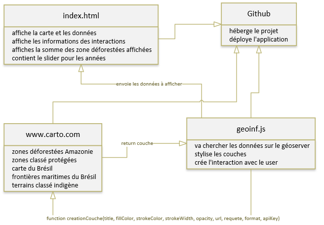

# deforestation-bresil

## Description

Pour le cours de géoinformation & openmapping, nous avons dû développer une application de cartographie en ligne intégrant :
* au moins deux couches de références à choix
* des couches en superpositions qui viennent enrichir la visualisation en pertinence avec la thématique
* au moins une couche en superposition de type vector et les possibilités d'interaction avec celle-ci
* une interaction avec un géoservices de traitement qui représente une valeur ajoutée à la visualisation

## Sujet

La forêt amazonienne est déforestée surtout pour l’élevage bovin et la culture du soja. La déforestation a commencé vers 1970. La forêt faisait 4'000'000 de km carré. C’est énorme, ça représente environ 100 la superficie de la Suisse. La déforestation a pu être grandement diminué en rendant certaines zones protégées, mais ça représente quand même environ 30'000 km de perte par annuel soit 20% pour l’instant qui est rasé.

## Sources
Il existe plusieurs institutions qui répertorient leurs travaux et études en géo données. 
Infoamazonia regroupent plusieurs jeux de données, notamment sur la forêt mais aussi les lacs, rivières et autres ressources naturelles. Sur ce site j’ai pu trouver des données faites par l’IBGE (l’Institut brésilien de géographie et de statistiques) et aussi par l’INPE (l’Institut national de recherche spatiale).
Les données sont situées ici :
* [pour la déforestation](http://mapas.mma.gov.br/i3geo/datadownload.htm?desm76 "IBGE pour la déforestation")
* [pour les zones protégées](http://data.globalforestwatch.org/datasets/prodes-deforestation "pour les zones protégées")
* [pour la carte et les zones indigènes](https://infoamazonia.org/en/datasets/ "pour la carte et les zones indigènes")
* 

## Application
Les couches de références sont OpenStreetMap et BingsMap.
Les couches d'intéraction sont les couches des zones protégées et les zones déforestées.
Les données sont hébergées sur [www.carto.com](https://carto.com/ "www.carto.com")

## Schéma d'architecture
présentation du fonctionnement de l'application
